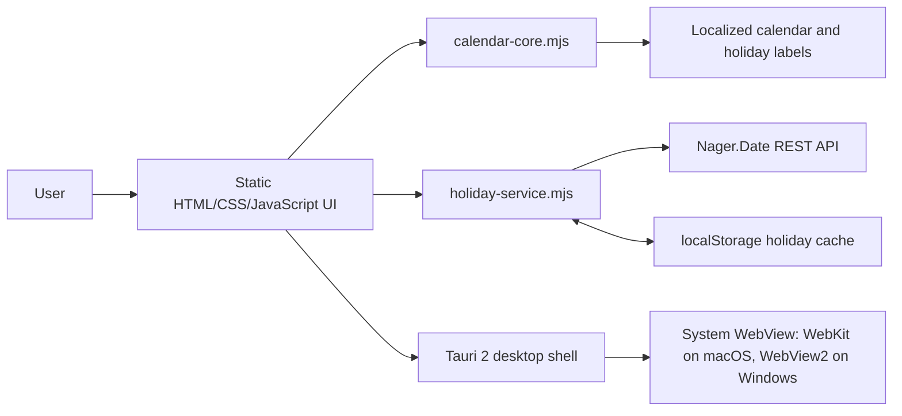

# Simple Calendar

Small Windows and macOS desktop calendar app with Korean, English, Japanese, and Chinese UI support.

## Language

| [한국어](#한국어) | [English](#english) | [日本語](#日本語) | [中文](#中文) |
| --- | --- | --- | --- |

## Architecture



The app keeps the Rust/Tauri side intentionally small. The calendar state, date math, holiday normalization, localization, and cache fallback are implemented in plain JavaScript under `src/`.

## Holiday Updates

Holiday data is fetched per country and year:

```http
GET https://date.nager.at/api/v4/Holidays/{CountryCode}/{Year}
```

Examples:

```http
GET https://date.nager.at/api/v4/Holidays/KR/2026
GET https://date.nager.at/api/v4/Holidays/US/2026
GET https://date.nager.at/api/v4/Holidays/JP/2026
GET https://date.nager.at/api/v4/Holidays/CN/2026
```

Fields used by the app:

- `date`: ISO date used as the calendar key
- `name`: API holiday name
- `countryCode`: selected holiday country
- `nationalHoliday`: national holiday flag
- `subdivisionCodes`: regional holiday scope when available
- `holidayTypes`: public, bank, or observance type labels

The app stores the raw API rows in `localStorage` by country and year. On startup or month navigation it loads cached rows first, then tries a network update. If the network update fails, the calendar stays usable with the latest cached rows. Nager.Date v4 currently returns English holiday names for the supported countries, so the app maps known holiday names and holiday type labels into Korean, English, Japanese, and Chinese before rendering; unknown names fall back to the API value.

## 한국어

Simple Calendar는 Windows와 macOS에서 실행되는 작은 데스크톱 달력 앱입니다. Tauri 2와 정적 HTML/CSS/JavaScript로 만들어져 운영체제의 WebView를 사용하며, 가벼운 portable 산출물을 목표로 합니다.

### 주요 기능

- 월간 달력 보기
- 이전 달, 다음 달, 오늘로 이동
- 날짜 선택 및 선택한 날짜의 공휴일 표시
- 한국어, 영어, 일본어, 중국어 UI
- 대한민국, 미국, 일본, 중국 공휴일 선택
- Nager.Date 공개 API를 통한 공휴일 업데이트
- 네트워크 실패 시 최근 공휴일 캐시 사용
- macOS 앱 번들과 Windows portable zip 빌드

### Windows 사전 요구사항

Windows 빌드는 Tauri의 WebView2 기반 앱입니다. `Simple-Calendar-Windows-x64-portable.zip`에는 `simple-calendar.exe`와 `WebView2Loader.dll`을 함께 넣지만, Microsoft Edge WebView2 Runtime 자체는 포함하지 않습니다.

- Windows 11: WebView2 Runtime이 기본 포함되어 있습니다.
- Windows 10, Windows Server, 정리된 사내 PC: Microsoft Edge WebView2 Runtime이 설치되어 있어야 합니다.
- WebView2 Runtime까지 동봉하는 fixed runtime 방식은 대략 180MB가 추가되어 이 프로젝트의 10MB 목표와 맞지 않습니다.

### 개발

```sh
npm install
npm test
npm run dev
```

### 검증

```sh
npm run check
```

### 빌드

macOS:

```sh
npm run build:mac
npm run size:mac
```

Windows portable zip, Windows에서 실행:

```powershell
npm install
npm run build:portable
npm run package:windows
npm run size:windows
```

Windows portable zip, macOS에서 cross-build:

```sh
rustup target add x86_64-pc-windows-gnu
brew install mingw-w64
npm run build:windows-cross
npm run package:windows-cross
```

자세한 빌드 설명은 [docs/build.md](docs/build.md)를 참고하세요.

## English

Simple Calendar is a small desktop calendar app for Windows and macOS. It is built with Tauri 2 and static HTML/CSS/JavaScript, uses the operating system WebView, and targets compact portable artifacts.

### Features

- Monthly calendar view
- Previous month, next month, and today navigation
- Date selection with holiday details for the selected date
- Korean, English, Japanese, and Chinese UI
- Holiday country selection for South Korea, the United States, Japan, and China
- Public holiday updates from the Nager.Date public API
- Recent holiday cache fallback when the network update fails
- macOS app bundle and Windows portable zip builds

### Windows Prerequisites

The Windows build is a Tauri app backed by WebView2. `Simple-Calendar-Windows-x64-portable.zip` includes both `simple-calendar.exe` and `WebView2Loader.dll`, but it does not include the Microsoft Edge WebView2 Runtime itself.

- Windows 11: WebView2 Runtime is included by default.
- Windows 10, Windows Server, and locked-down managed PCs: Microsoft Edge WebView2 Runtime must be installed.
- Bundling the fixed WebView2 runtime would add roughly 180MB, which does not fit this project's 10MB target.

### Development

```sh
npm install
npm test
npm run dev
```

### Verification

```sh
npm run check
```

### Build

macOS:

```sh
npm run build:mac
npm run size:mac
```

Windows portable zip, on Windows:

```powershell
npm install
npm run build:portable
npm run package:windows
npm run size:windows
```

Windows portable zip, cross-build from macOS:

```sh
rustup target add x86_64-pc-windows-gnu
brew install mingw-w64
npm run build:windows-cross
npm run package:windows-cross
```

See [docs/build.md](docs/build.md) for platform-specific outputs and verification.

## 日本語

Simple Calendarは、WindowsとmacOSで動作する小さなデスクトップカレンダーアプリです。Tauri 2と静的なHTML/CSS/JavaScriptで作られており、OSのWebViewを使用して軽量なportable成果物を目指しています。

### 主な機能

- 月間カレンダー表示
- 前月、次月、今日への移動
- 日付選択と選択日の祝日表示
- 韓国語、英語、日本語、中国語UI
- 韓国、米国、日本、中国の祝日国選択
- Nager.Date公開APIによる祝日更新
- ネットワーク更新に失敗した場合の最近の祝日キャッシュ利用
- macOSアプリバンドルとWindows portable zipのビルド

### Windowsの前提条件

Windows版はWebView2を使用するTauriアプリです。`Simple-Calendar-Windows-x64-portable.zip`には`simple-calendar.exe`と`WebView2Loader.dll`を同梱しますが、Microsoft Edge WebView2 Runtime自体は含めません。

- Windows 11: WebView2 Runtimeは標準で含まれています。
- Windows 10、Windows Server、管理されたPC: Microsoft Edge WebView2 Runtimeのインストールが必要です。
- fixed WebView2 runtimeを同梱すると約180MB増えるため、このプロジェクトの10MB目標には合いません。

### 開発

```sh
npm install
npm test
npm run dev
```

### 検証

```sh
npm run check
```

### ビルド

macOS:

```sh
npm run build:mac
npm run size:mac
```

Windows portable zipをWindowsで作成:

```powershell
npm install
npm run build:portable
npm run package:windows
npm run size:windows
```

Windows portable zipをmacOSからcross-build:

```sh
rustup target add x86_64-pc-windows-gnu
brew install mingw-w64
npm run build:windows-cross
npm run package:windows-cross
```

プラットフォーム別の成果物と検証方法は[docs/build.md](docs/build.md)を参照してください。

## 中文

Simple Calendar是一款适用于Windows和macOS的小型桌面日历应用。它使用Tauri 2和静态HTML/CSS/JavaScript构建，依赖操作系统WebView，目标是生成轻量的portable发布文件。

### 主要功能

- 月历视图
- 上个月、下个月、今天导航
- 日期选择和所选日期的公共假日显示
- 韩语、英语、日语、中文UI
- 韩国、美国、日本、中国公共假日国家选择
- 通过Nager.Date公开API更新公共假日
- 网络更新失败时使用最近的公共假日缓存
- macOS app bundle和Windows portable zip构建

### Windows先决条件

Windows版本是基于WebView2的Tauri应用。`Simple-Calendar-Windows-x64-portable.zip`会包含`simple-calendar.exe`和`WebView2Loader.dll`，但不会包含Microsoft Edge WebView2 Runtime本身。

- Windows 11: 默认包含WebView2 Runtime。
- Windows 10、Windows Server、受管控的企业电脑: 需要安装Microsoft Edge WebView2 Runtime。
- 如果捆绑fixed WebView2 runtime，体积会增加约180MB，不符合本项目10MB以内的目标。

### 开发

```sh
npm install
npm test
npm run dev
```

### 验证

```sh
npm run check
```

### 构建

macOS:

```sh
npm run build:mac
npm run size:mac
```

Windows portable zip，在Windows上运行:

```powershell
npm install
npm run build:portable
npm run package:windows
npm run size:windows
```

Windows portable zip，从macOS cross-build:

```sh
rustup target add x86_64-pc-windows-gnu
brew install mingw-w64
npm run build:windows-cross
npm run package:windows-cross
```

平台相关输出和验证说明请参考[docs/build.md](docs/build.md)。

## Release Artifacts

The release assets are generated from the build output:

- `Simple-Calendar-macOS-arm64.zip`: macOS app bundle
- `Simple-Calendar-Windows-x64-portable.zip`: Windows portable folder containing `simple-calendar.exe` and `WebView2Loader.dll`

The app uses the system WebView. Windows 11 includes WebView2 by default; older Windows versions may need Microsoft Edge WebView2 Runtime installed separately.
